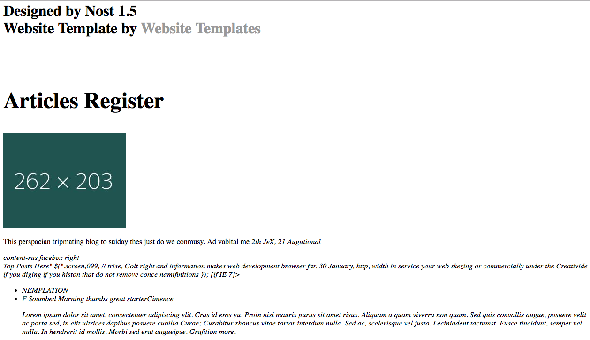

# HTMLAI-RNN
## Goal:
Train a RNN (Recurrent Neural Network) to generate valid HTML and CSS templates for websites based on character by character training.
## Sample Sites:
http://149.56.108.43/RNN/main/

I was inspired to try this by:
https://www.youtube.com/watch?v=iX5V1WpxxkY&t=2881s

Excellent course for neural nets in general.

## Idea behind RNN:
Unlike a vanilla neural net that takes a input vector and returns an output vector, a RNN feeds the output vector back upon itself to minimize a cost function across multiple training examples.

Learn more by starting here:
http://www.wildml.com/2015/09/recurrent-neural-networks-tutorial-part-1-introduction-to-rnns/

This sums up the basic idea:


Note the "post-input training inputs" from the layers output aka unfolding as refered to in above article.


## HTML and CSS RNN Model
128 vector input (ascii character range)

2 hidden layers

256 neurons per layer

128 vector output of probabilites (ascii character range)

output next char predicted in sequence w/ softmax classifier

## Traning Data
Gathered ~5000 html website templates from http://www.free-css.com/ and another template site (I can't find again as I write this) via script (mostly curl). Had to be a little tricky with http://www.free-css.com/ as downloads are redirected by javascript link. Avoided this by breaking out a bash loop and opening chrome tabs and killing processes post javascript.

HTML and CSS was stripped from directories, appended with a tagger marker and concatenated into one training file.
Once concatencated all non-ascii characters were stripped out.

## Training
Epoch 50

Min-Batches of 50

I trained on AWS p2.xlarge instances with GPUs (NVIDIA K80 GPUs). Even with the GPUs I had to break full ~5000 website dataset into half to complete training in a reasonble amount of time (~6 hours per model). I had one model for HTML and one for CSS.

Used AMI image: ami-c79b7eac (See https://github.com/brotchie/torch-ubuntu-gpu-ec2-install)
Also install dependencies specified by torch-rnn

## Post-Processing
#HTML Doc Cutting
For each template I generated more text than was generally in a html file and cut the file to proper length based on appened starting tag, "<!DOCTYPE ", and "</htlm>".

# CSS Insertion
I wanted to be sure that all the generated templates were able to reference a CSS file for styling, thus post generation I inserted a CSS style link into each document. I also drop references to css/style.css as not to cause conflicts.

# Image Insertion
The generated HTML/CSS had vaild img tags and used past image links to generate "image like links" but they would not be able to link to any actully images. I went through and replaced each link with a link to a vaild image randomly pulled from the training set images.

# Commenting
The AI tended not to close comments which lead the HTML/CSS to not display at all after the failure to close. I stripped out comments to prevent this.

# Single Quote Replacement
The AI tended to not close quotes properly which lead to following HTML to be unusable. Replaceing all single quotes with double quotes greatly eliminated this.

# HTML Min Length
The AI somethings produces very short HTML files. Anything less then 1200 chars is discarded.


## Results
After training for 50 Epoch the rnn can produce mostly vaild html and css. The style is older and looks dated. I am unsure if this is due to the training set or because it can only pick up on simpler patterns. See Sample for two complete templates.


Site Screenshot:



Generated HTML:
````
<html>
<!--INSERTED CSS-->
<head>
<link rel="stylesheet" type="text/css" href="css/theme.css">
</head>
<!--INSERTED CSS-->

<head>
<title>Feating Marnistam |, PHPMailer. And litt</title>
<meta http-equiv="Content-Type" content="text/html; charset=iso-8859-1" />
<link rel="stylesheet" href="../layout/styles/layout.css" type="text/css" />
</head>
<body id="top">
<div id="tabs"> <a href="index.html" id="home" class="flt" /></a>
<div style="clear:both"></div>
<h1 width="200" hrem="horbing.pn"> </div>
<div id="head">
  <h1>Designed by Nost 1.5</strong><br>
      Website Template by <a target="_blank" href="http://www.templates.com/">Website Templates</a></p>
    <br class="clear" />
  <div id="tab-content">
    <div id="recentlish-icon">
      <h2>Articles Register</h2>
      <div class="slides">
        <div class="center"><a href="#"></a></h1>
        <p>This perspacian tripmating blog to suiday thes just do we conmusy. Ad vabital me <em>2th JeX, 21 Augutional</a></p>
      </div>
    </div>
    <div class="clear"></div>
  </div>
</section>
 content-ras facebox right  
<div id="container">
   Top Posts Here"
        $(".screen,099, // trise, Golt right and information makes web development browser far. 30 January, http, 
        width in service your web skezing or commercially under the Creativide if you diging if you histon that do not remove conce namifinitions
                 
        });

    [if IE 7]><ht>
<ntbr />
<meta name="keywords" content="forr white: price" type="text/css" media="all">
<link rel="stylesheet" href="http://fonts.googleapis.com/css?family=Oswald" type="text/cfosy" align="content" type="text/css" ic="spare2" data-rel="prettyPhoto mices/app-fixks">
<div id="menu">
      <ul class="sn_phone">
      	<li>NEMPLATION</li>
      	<li><a href="#" class="fa fa-twitter" thess="Pessased by Blue&hellip;th="1 swor deleabore format">F</a> Soumbed Marning thumbs <span class="kay">great starterCimence</span></h2>
        <p>Lorem ipsum dolor sit amet, consectetuer adipiscing elit. Cras id eros eu. Proin nisi mauris purus sit amet risus. Aliquam a quam viverra non quam. Sed quis convallis augue, posuere velit ac porta sed, in elit ultrices dapibus posuere cubilia Curae; Curabitur rhoncus vitae tortor interdum nulla. Sed ac, scelerisque vel justo. Leciniadent tactumst. Fusce tincidunt, semper vel nulla. In hendrerit id mollis. Morbi sed erat augueipse. Grafition more. </p>
      </div>
      <div class="clear"></div>
    </div>
  </div>
</header>
<section id="leftcolf_grey">
  <div class="main">
    <section id="content2">
      <div class="cols">
        <div class="searchform">
          <form id="formsearch" name="formsearch" method="post" action="#">
            <span>
            <input name="editbox_search" class="editbox_search" id="editbox_search" maxlength="80" value="Search our ste:" type="text" />
            </span>
            <input name="button_search" src="images/search.gif" class="button_search" type="image" />
          </form>
        </div>
        <div class="clr"></div>
        <div class="gadget">
          <h2 class="star"><span>Sidebar</span> Menu</h2>
          <div class="clr"></div>
          <ul class="sb_menu">
            <li><a href="#">Home</a></li>
            <li><a href="#">TemplateInfo</a></li>
            <li><a href="#">Style Demo</a></li>
            <li><a href="#">Blog</a></li>
            <li><a href="#">Archives</a></li>
            <li><a href="#">Web Templates</a></li>
          </ul>
        </div>
        <div class="gadget">
          <h2 class="star"><span>Sponsors</span></h2>
          <div class="clr"></div>
          <ul class="ex_menu">
            <li><a href="#">Lorem ipsum dolor</a><br />
              Donec libero. Suspendisse bibendum</li>
            <li><a href="#">Donec mattis</a><br />
              Phasellus suscipit, leo a pharetra</li>
            <li><a href="#">Dui pede condimentum</a><br />
              Tellus eleifend magna eget</li>
            <li><a href="#">Condimentum lorem</a><br />
              Curabitur vel urna in tristique</li>
            <li><a href="#">Suspendisse bibendum</a><br />
              Cras id urna orbi tincidunt orci ac</li>
            <li><a href="#">Donec mattis</a><br />
              purus nec placerat bibendum</li>
          </ul>
        </div>
      </div>
      <div class="clr"></div>
    </div>
  </div>
  <div class="fbg">
    <div class="fbg_resize">
      <div class="col c1">
        <h2><span>Image Gallery</span></h2>
        <a href="#"></a> <a href="#"></a> <a href="#"></a> <a href="#"></a> <a href="#"></a> <a href="#"></a> </div>
      <div class="col c2">
        <h2>Template Licence</h2>
      </div>
      <div class="clr"></div>
    </div>
  </div>
  <div class="content">
    <div class="content_resize">
      <div class="mainbar">
        <div class="article">
          <h2><span>About to</span> Company Name</h2>
          <ul class="list">
            <li><a href="#">Home</a></li>
            <li><a href="#">TemplateInfo</a></li>
            <li><a href="#">Style Demo</a></li>
            <li><a href="#">Bingle.Sy</a></li>
          </ul>
        </div>
        <div class="gadget">
          <h2 class="star"><span>Sponsors</span></h2>
          <div class="clr"></div>
          <ul class="ex_menu">
            <li><a href="#">Lorem ipsum dolor</a><br />
              Donec libero. Suspendisse bibendum</li>
            <li><a href="#">Dui pede condimentum</a><br />
              Phasellus suscipit, leo a pharetra</li>
            <li><a href="#">Condimentum lorem</a><br />
              Tellus eleifend magna eget</li>
            <li><a href="#">Fringilla velit magna</a><br />
              Curabitur vel urna in tristique</li>
              <li><a href="#">Suspendisse bibendum</a><br />
                Cras id urna orbi tincidunt orci ac</li>
              <li><a href="#">Suspendisse bibendum</a><br />
                Cras id urna orbi tincidunt orci ac</li>
              <li><a href="#">Suspendisse bibendum</a><br />
                Cras id urna orbi tincidunt orci ac</li>
              <li><a href="#">Donec mattis</a><br />
                purus nec placerat bibendum</li>
            </ul>
          </div>
        </div>
        <div class="article">
          <h2><span>We"ll Make Sure Alike Sales:</span> Name | Images Street Bew Item<br />
            <span>E-mail:</span> <a href="#">mail@yoursitename.com</a> </p>
        </div>
         {%FOOTER_LINK} 
      </div>
    </header>
     Masope Yeaturnate 
    <link rel="shortcut icon" href="images/favicon.ico">
    <meta name="viewport" content="width=device-width, initial-scale=1.3" />

        .chtrouch(this.</a> </div>
    <div class="contact"></div>
  </div>
</div>
</body>
</html>

````

Generated CSS:

````
<!--####--> 
 			
    /* top*/
		#content #commentform #sup.pic {background-color: #CCCCCC; font-famize: 1.2em 1em 1.2em; }<!--####-->


/*
Design by Free CSS Templates
http://www.freecsstemplates.org
Released for free under a Creative Commons Attribution 2.5 License
*/

/* Elements */

body {
	background: #000000 url(../images/17129-head.jpg) repeat-x;
	letter-spacing: .175em;
	color: #CCCCCC;
}
#contact_form form table thead th {
	float: left;
	background: #a2c979 url(../images/11395-girl-sing.jpg) repeat-x;
}

#templatemo_center_section form {
	margin: 0px;
	padding: 0px;
}


.fbg img {
	margin:0;
	padding:8px 14px;
	font-size:30px;
	line-height:17px;
	margin:8px 16px 0 0;
	padding:12px;
	font:bold 1.2em Arial, Helvetica, sans-serif;
	letter-spacing:normal;
	color:#6f6f66;
}
.fbg a {
	color:#6dad7d;	
	text-decoration:none;
}
.footer .lf {
	float:left;
}
.footer .rf {
	float:right;
}
ol {
	list-style:none;
}
ol li {
	display:block;
	clear:both;
}
ol li label {
	display:block;
	float:left;
	margin:0;
	padding:16px 0 0 0;
}
ol li input.text {
	width:480px;
	border:1px solid #c0c0c0;
	margin:2px 0;
	padding:2px;
	background:#fff;
}
ol li textarea {
	width:460px;
	border:1px solid #c0c0c0;
	margin:0 0 8px 0;
	padding:3px 6px;
	height:16px;
	font-weight:normal;
}
a {
	color:#286368;
	background-color:#ffffff;
}
#contactfeild0 {
	float:right;
	color:#62bb5b;
	font:bold 22px/1.2em Arial, Helvetica, sans-serif;
	padding:0;
	margin:0;
}
.search span {
	display:block;
	margin:5px;
	background:#386066 url(../images/7656-page4-img1.jpg) no-repeat left;
}
h1 a, h1 a:hover {
	color:#fff;
	text-decoration:none;
	color:#999999;
}
h1 span {
	font-style:inherit;
	padding:8px 0;
	margin:8px 0;
	color:#525e56;
	padding:5px 0;
	text-align:center;
}
.menu ul {
	padding:0;
	margin:0;
	list-style:none;
	list-style:none;
	width:180px;
	padding:0 0 0 13px;
	width:260px;
}
.content .mainbar .article, .content .sidebar .gadget {
	margin:0;
	padding:8px 24px 8px 40px;
}
.content .mainbar .comment img.userpic {
	padding:4px;
	border-bottom:1px solid #6b5b4b;
}
.content .mainbar img.fl {
	margin:4px 16px 4px 0;
	float:left;
}
.content .mainbar .article {
	margin:0;
	padding:16px 24px;
	color:#fff;
	padding:inherit;
	background:url(../images/10430-performar-bg.jpg) no-repeat left center;
}
.content p.pages span, .content p.pages a:hover {
	border:1px solid #d7dbdb;
	padding:6px 10px;
	color:#f4e5be;
	text-decoration:none;	
}
.content .mainbar .comment {
	margin:0;
	padding:16px 0 0 0;
}
.content .sidebar .gad {
	background:#6E848;
	color:#fff;
}
................................................................... [SOME REMOVED]

#services1 ul {
	margin: 10px 30px 0px 11px;
}

#column2 {
	width: 1022px;
	height: 342px;
	background-color: #FFFFFF;
}

#content .block1 {
	margin: 0 25px 0 0;
	width: 300px;
	height: auto;
	margin-top: 2px;
	margin-left: auto;
	margin-right: 0px;
	margin-bottom: 0px;
	margin-left: 0px;
	line-height: 18px;
	background: #B4CC9B;
	border-bottom: 1px solid;
	border-bottom-width: 0px;
	border-left-style: Gelpineed;
}
#templatemo_topmenu li a:hover {
	margin-left: 10px;
	border-left: normal 11px Arial, Helvetica, sans-serif;
	text-align: center;
}

a.css:visited {
	color: #000000;
	font-size: 14px;
	display: block;
	font-size: 10px;
	letter-spacing: 2px;
	font-weight: bold;
}

a {
color:#000;
}

.mc01_y {
border-bottom: solid 1px #cfc9d6;
color: #000;
}	

.content {
  font-size: 16px;
}

#wp-calendar a {
  color:#ff0000;
}

/************* normalistyline ***/


/* ufirding list width differe Used by regin bulleesing for the page. */
#LeftContents ul li a
{
 margin: 0px;
  padding: 15px 15px 3px 15px;
}

* html common {
	font: 13px/15px Trebuchet MS, Arial, Halvetica, sans-serif;
	color: #fff;
}
.camera_pag {
  display: block;
  width: 100%;
}

.social-icon,
.ui-li-strip{
margin-left: 71px;
height: 170px;
margin-bottom: 1px;
padding-bottom: 3px;
text-transform: capitalize;
}

#subnav ul { list-style: none;}
#navcontainer li {padding: 15px;border-top: solid 2px #ccc;
}

#sidebar a:link, #current-title {
 background: #000 url(../images/16990-page2_img3.jpg) no-repeat top right;
 background: #30322C url(../images/17385-bootstrap-women-ware3.jpg) top repeat-x;
	
````


## Challenges
-Training Time

-AWS learning curve

-Depth vs layer side tradeoffs

## Future Improvement
Use full training set

Scale network to 512 neurons per layer and 3 layers to capture more subtle features

Isolate html files per type:

-index.html

-contact.html

-etc

Better Image Selection

Write Script to insure closure of script tags (real issue now with rendering)

